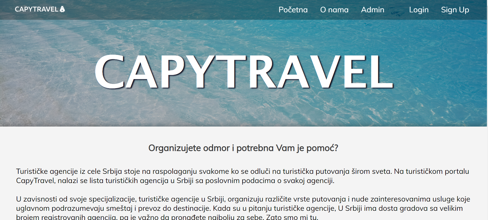
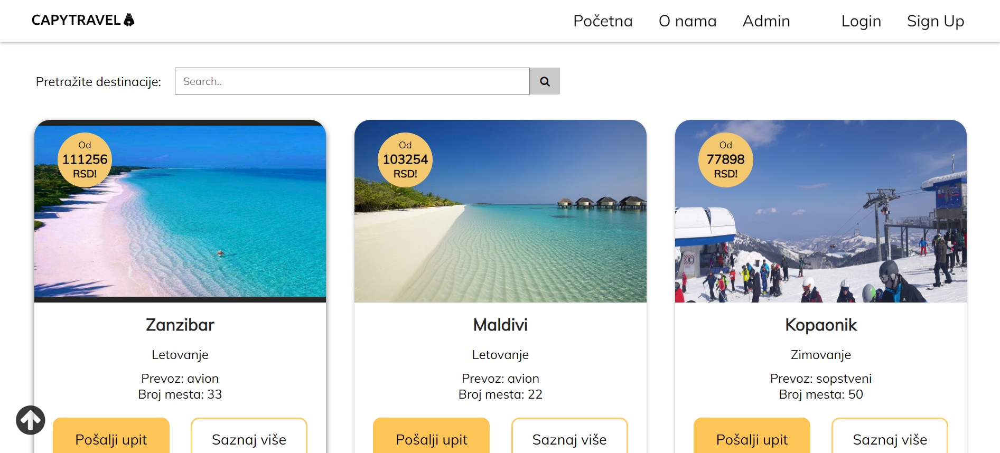

# CapyTravel 🌍 ₍ᐢ-(ｪ)-ᐢ₎

A responsive website for managing tourist agencies.

---

This was a university project for the course "Web Design", taken in the 2nd semester of the Software Engineering and Information Technologies program.

The ``goal`` of the project was to:
- apply the acquired knowledge in web design,
- get familiar with JavaScript and frontend web programming basics,
- connect to Firebase and create a dynamic website
#
Technologies used: 
- ``HTML``
- ``Pure CSS``
- ``JavaScript``
- ``Firebase``
#
Date: June, 2023.

---

# How does it work? ❓
- displays the travel agencies and their destinations,
- enables a search option,
- supports CRUD operations on agencies, destinations, and users,
- utilizes Firebase to simulate a backend

---

# Visual Design ✨

---

# Using the Website ⚙️

To use this website, follow the next steps:
1) clone this repo, 
2) double-click on the index.html file (location: wd-sv-48-2022\PROJECT - TRAVEL AGENCIES\html\index.html)

---

# Examples 💡

The website displays the travel agencies and their destinations, with a search option provided. CRUD operations are supported, such as: user registration, add, edit, and delete agencies, destinations, and users.

- REGISTRATION
  - users can register by entering correct informations.
- LOGIN
  - users can log into the website by entering their username and corresponding password,
  - login functionality is not implemented - all users have the same website display and access to the Admin panel
- SEARCH
  - users can search for agencies by name and destinations, as well as destinations by name, type, or transportation.
- ADMIN PANEL
  - users can display, add, edit, or delete individual agencies, destinations, or users.

